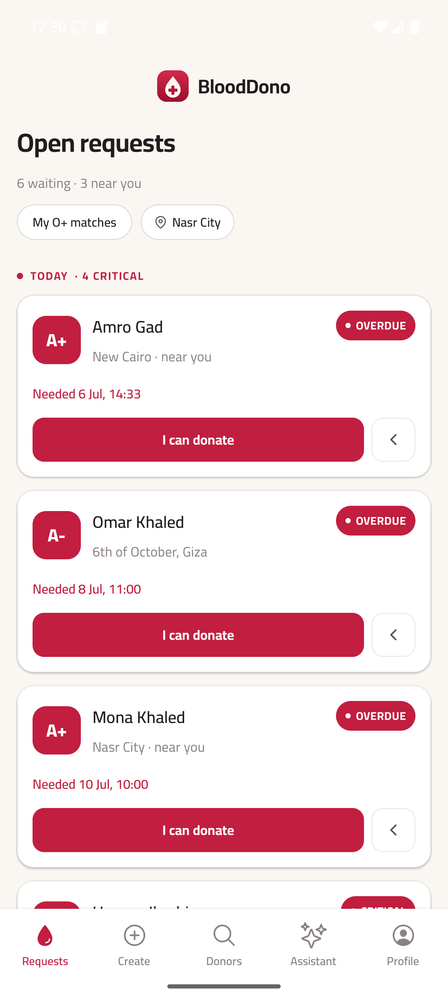
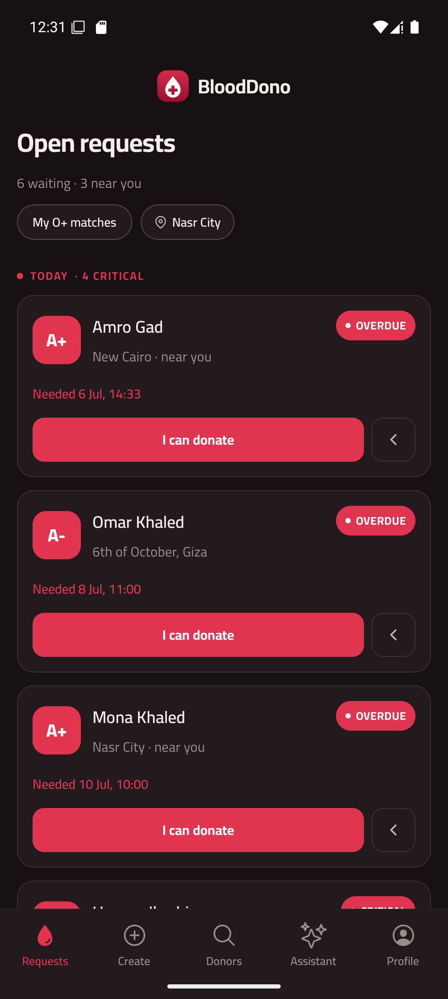
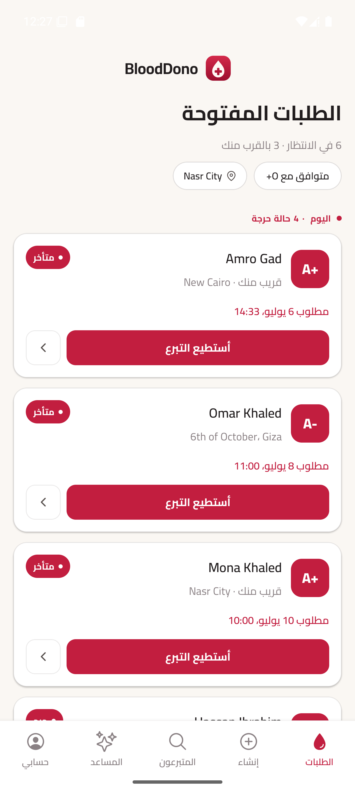
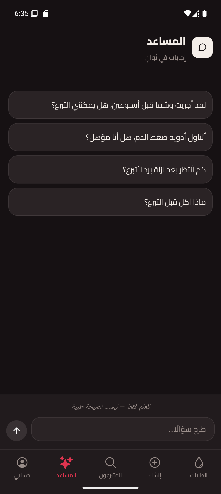
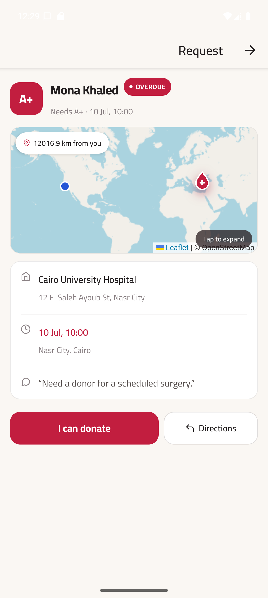
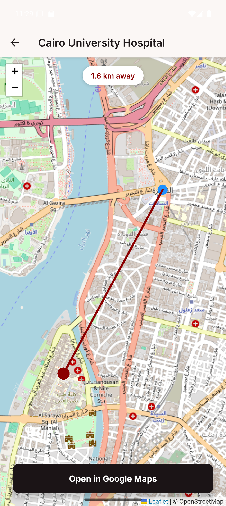
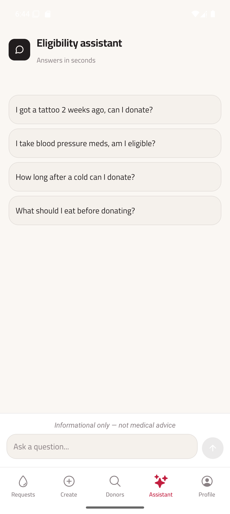
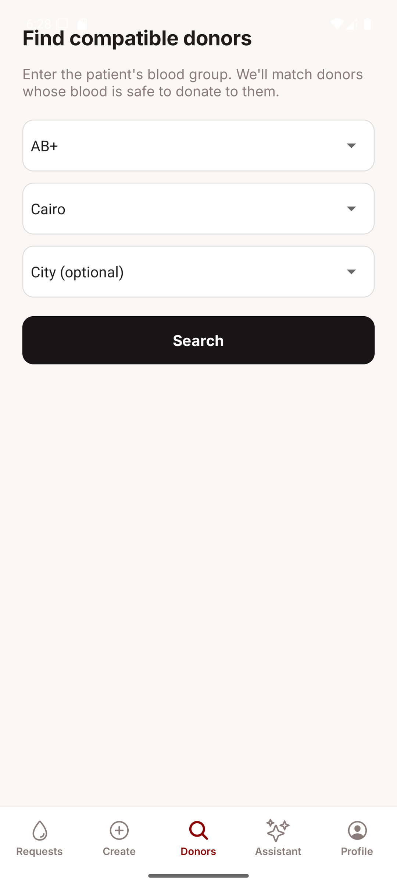
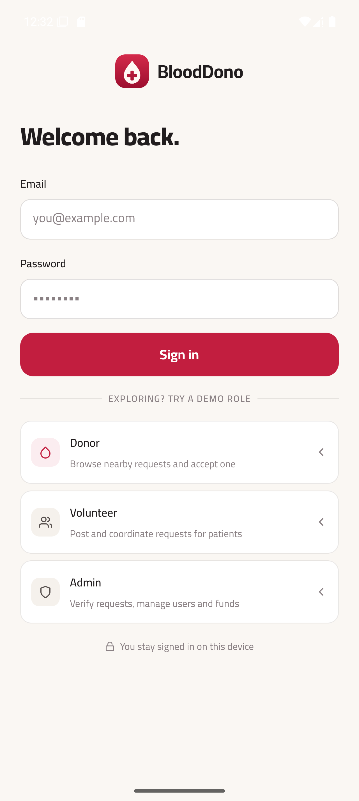
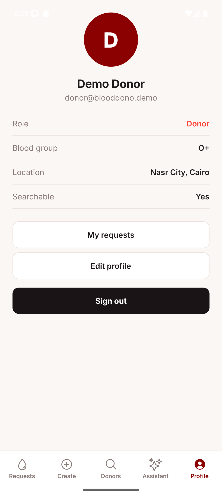

# BloodDono Mobile

A React Native app for connecting blood donors with nearby donation requests. Donors browse requests sorted by proximity, post their own, and search for compatible donors by blood group and location. Each request shows a live hospital map with the distance from wherever the donor is standing.

The [web version](https://blooddono-two.vercel.app/) shares the same Supabase backend — same data, different experience.

## Highlights

- 🔔 Push notifications for new compatible requests in your governorate
- 📍 Location-aware request sorting — nearby requests rise to the top automatically
- 🩸 Blood compatibility matching, not exact-type matching (O- donors see A+, B+, AB+ requests)
- 🗺️ Interactive hospital maps with live distance, built on Leaflet + OpenStreetMap (no API key needed)
- 🤖 AI eligibility assistant powered by Groq (Llama 3.1), personalized to your blood group and city
- 🌐 Full Arabic + English support with RTL layout that mirrors automatically on switch
- 🌙 Dark and light mode, persisted across sessions

## Download

Build an APK with EAS (no local Android SDK needed):

```bash
npm install -g eas-cli
eas build -p android --profile preview
```

Or build locally after cloning and setting up the `.env`:

```bash
npx expo prebuild --clean
cd android && ./gradlew assembleRelease
```

The `.apk` ends up in `android/app/build/outputs/apk/release/`.

## Demo accounts

The login screen has one-tap demo logins — no signup needed:

| Role | Email | Password |
|---|---|---|
| Donor | `donor@blooddono.demo` | `Demo123!` |
| Volunteer | `volunteer@blooddono.demo` | `Demo123!` |
| Admin | `admin@blooddono.demo` | `Demo123!` |

## Demo walkthrough

Under 3 minutes to see the core loop:

1. Log in with the Donor demo account.
2. Browse the requests feed — your O+ matches are filtered by default, sorted nearest first.
3. Open a request to see the hospital on the map and the kilometer distance from you.
4. Switch to the Create tab and post a new request (3-step wizard).
5. Go to Find Donors, pick a blood group and governorate, and see compatible donors.
6. Open the Assistant tab and ask "I had surgery last month, can I donate?" — it replies in whichever language the app is in.
7. Switch to the Volunteer or Admin demo account to see the coordinator and admin views.

## Features

- Browse pending requests sorted by proximity to the donor's governorate and city, with "near you" badges and urgency sections (Critical, Urgent, Planned)
- Blood compatibility matching — searching for A+ donors also surfaces O+ and O- donors who can safely donate
- Post a request in 3 steps: patient details, hospital location, blood group and date
- Interactive Leaflet map on each request showing the hospital pin, the donor's live position, and the straight-line distance between them
- Accept a request as a donor, which moves it from pending to in-progress
- Find compatible donors by patient blood group and location
- AI eligibility assistant for questions like "I take blood pressure medication, am I eligible?" — answers are personalized to your blood group and city, and the assistant replies in the active language
- Push notifications when a new request needs a compatible blood type in your governorate
- Arabic and English with automatic RTL layout mirroring — switch without leaving the app
- Dark and light themes, persisted with AsyncStorage
- Real profile with blood group, role badge, and location
- Persistent sessions — stay signed in across restarts

## Screenshots

| EN · Light | EN · Dark |
|---|---|
|  |  |

| AR · Light · RTL | AI assistant · AR · Dark |
|---|---|
|  |  |

| Request detail | Fullscreen map |
|---|---|
|  |  |

| AI assistant · EN | Find donors |
|---|---|
|  |  |

| Login | Profile |
|---|---|
|  |  |

## Architecture

```
Screens (expo-router)
        ↓
TanStack Query  ·  React Context (auth + theme + locale)
        ↓
Service layer (Supabase RPCs, Nominatim, Edge Functions)
        ↓
Supabase (PostgreSQL · Auth · Storage · Edge Functions)
        ↓
Groq (Llama 3.1) · Expo push notifications
```

## Built with

- 13 screens across 3 route groups
- 6 shared components (BloodRoundel, RequestCard, Pills, Avatar, SkeletonCard, BrandHeader)
- 96 automated tests
- Shared Supabase backend with the web version

## Tech stack

### App
- React Native · Expo SDK 56 · TypeScript
- expo-router (file-based navigation, route groups for auth/tabs)
- TanStack Query (server state, caching, background refetch, skeleton loaders)
- React Context (auth session, theme, locale)
- Leaflet in a WebView with OpenStreetMap tiles — no maps API key required
- expo-location for live position
- Nominatim (OpenStreetMap) for hospital geocoding
- react-i18next for Arabic/English with I18nManager RTL integration
- @expo-google-fonts/cairo + @expo-google-fonts/bricolage-grotesque

### Backend
- [Supabase](https://supabase.com/) — hosted auth, PostgreSQL, RPCs, storage
- Supabase Edge Functions (Deno) — push notification fan-out and eligibility assistant
- [Groq](https://groq.com/) (Llama 3.1 8B Instant) — AI assistant, called server-side, free tier
- Expo push notifications

## Testing

```bash
npm test -- --runInBand
```

96 tests across:

- Supabase service wrappers (donations, profiles, geocoding, assistant)
- Auth provider bootstrap
- Login screen
- Pure utilities: haversine distance, proximity sorting, blood compatibility, form validation, error mapping
- i18n key parity (every EN key has an AR translation)

## Why I built this

Blood shortages are a real logistic problem — patients need specific types, donors are willing, but there's no fast way to connect them. BloodDono is that connection, built as a full-stack portfolio project to show what a real app looks like end-to-end: live maps, push notifications, an AI feature, and a bilingual RTL interface.

## Getting started

Node LTS, a Supabase project, and either an Android emulator or the Expo Go app on a physical device.

```bash
npm install
cp .env.example .env
```

Fill in `.env`:

```
EXPO_PUBLIC_SUPABASE_URL=your-project-url
EXPO_PUBLIC_SUPABASE_ANON_KEY=your-anon-key
```

Start Metro:

```bash
npx expo start
```

Press `a` for Android or scan the QR code in Expo Go. No maps API key required — Leaflet uses OpenStreetMap tiles.

## Project structure

```
src/
├── app/
│   ├── (auth)/         login screen
│   ├── (tabs)/         requests, create, donors, assistant, profile
│   ├── request/[id]    request detail + inline map
│   ├── edit-request/   edit an existing request
│   ├── my-requests     requests posted by the current user
│   ├── profile-edit    edit name, blood group, location
│   ├── map             fullscreen hospital map
│   └── funds/          community fund + payment
├── components/         BloodRoundel, RequestCard, Pills, Avatar, SkeletonCard, BrandHeader
├── providers/          AuthProvider, ThemeProvider, LocaleProvider
├── services/           Supabase RPCs, geocoder, assistant Edge Function
├── hooks/              useProfile, useLocation, usePushNotifications
├── i18n/               en.json + ar.json, i18next singleton
├── utils/              distance, proximity sort, blood compatibility, validation, errors, mapHtml
├── constants/          theme tokens (colors, fonts, spacing, shadows)
└── data/               governorates + cities
```
