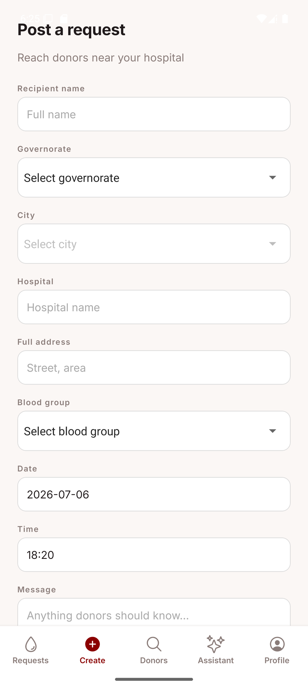

# BloodDono Mobile

React Native companion app for BloodDono, built with Expo, TypeScript, and Supabase.

Donors browse blood donation requests near them, post their own, and search for compatible donors by blood group and location. Each request detail shows a Google Map with the hospital pinned and the distance from the donor's current location.

The [BloodDono web app](https://blooddono-two.vercel.app/) shares the same Supabase backend.

## Try it yourself

The login screen has one-click Demo logins for all three roles, no signup needed:

| Role | Email | Password |
|---|---|---|
| Admin | `admin@blooddono.demo` | `Demo123!` |
| Donor | `donor@blooddono.demo` | `Demo123!` |
| Volunteer | `volunteer@blooddono.demo` | `Demo123!` |

## Features

- Browse pending requests, sorted by proximity to the donor's governorate and city (with an "In your area" badge)
- Post a donation request with recipient details, hospital, address, blood group, and time
- Open a request to see the hospital on a Google Map, your live position, and the kilometer distance between them
- Accept a request as a donor, which moves it from pending to inprogress
- Search for compatible donors by patient blood group and location (matches by blood-type compatibility, not exact type)
- Real profile screen with role, blood group, and location
- Persistent sessions with AsyncStorage, so you stay signed in across restarts
- Pull-to-refresh on the requests list

## Screenshots

| Login | Requests |
|---|---|
|  |  |

| Request detail | Create request |
|---|---|
|  |  |

| Find donors | Profile |
|---|---|
|  |  |

## Tech stack

### App
- React Native and Expo (SDK 56)
- TypeScript
- expo-router (file-based navigation)
- TanStack Query (server state, caching, refetch)
- React Context (auth session)
- react-native-maps with Google Maps
- expo-location for the user's current position
- Nominatim (OpenStreetMap) for hospital geocoding
- expo-linear-gradient, @expo-google-fonts/inter

### Backend (managed service)
- [Supabase](https://supabase.com/) for hosted authentication, database, and RPCs. Same project as the web app.

### Testing
- Jest with jest-expo
- React Native Testing Library

## Getting started

You'll need Node LTS, a Supabase project, and either an Android emulator (with Google Play services) or the Expo Go app on a physical device.

```bash
npm install
cp .env.example .env
```

Fill in `.env` with your Supabase URL and anon key:

```
EXPO_PUBLIC_SUPABASE_URL=your-project-url
EXPO_PUBLIC_SUPABASE_ANON_KEY=your-anon-key
```

Start Metro and open the app:

```bash
npx expo start
```

Press `a` for Android, or scan the QR code in Expo Go.

### Google Maps on Android

The hospital map uses Google Maps. In Expo Go the tiles ship with Expo's bundled configuration, which is fine for a quick look but often flaky. To use your own key you'll need a development build.

1. Create a Google Maps API key in the Google Cloud Console and enable "Maps SDK for Android"
2. Add it to `.env` as `GOOGLE_MAPS_API_KEY` (read by `app.config.js`)
3. Build a development client with EAS:

```bash
npx eas-cli build --platform android --profile development
```

## Testing

```bash
npm test
```

Covers the auth service, the auth provider bootstrap, and the distance utility.

## Project structure

Everything lives under `src/`:

- `src/app/` – expo-router routes, grouped as `(auth)` for the login and `(tabs)` for the main app
- `src/services/` – thin wrappers over Supabase RPCs, the Supabase client, and the Nominatim geocoder
- `src/providers/AuthProvider.tsx` – session context, mirrors the web app's auth bootstrap
- `src/hooks/` – `useProfile`, `useLocation`
- `src/components/` – shared UI like the brand header and skeleton loader
- `src/constants/` – `theme` (colors/spacing/type matching the web palette) and the demo accounts
- `src/utils/` – `distance` (haversine km) and `errors` (friendly Supabase messages)
- `src/data/` – governorate and city data reused from the web app
