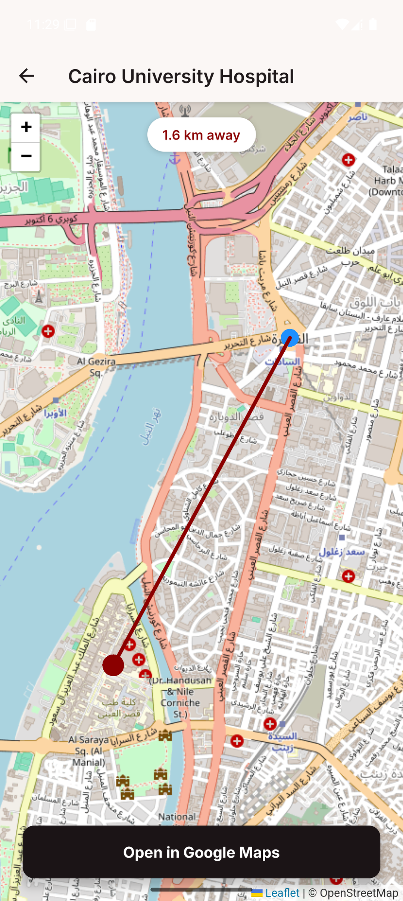
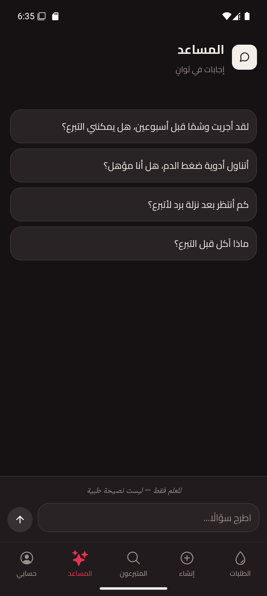
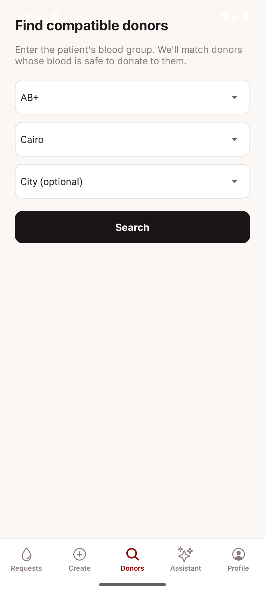
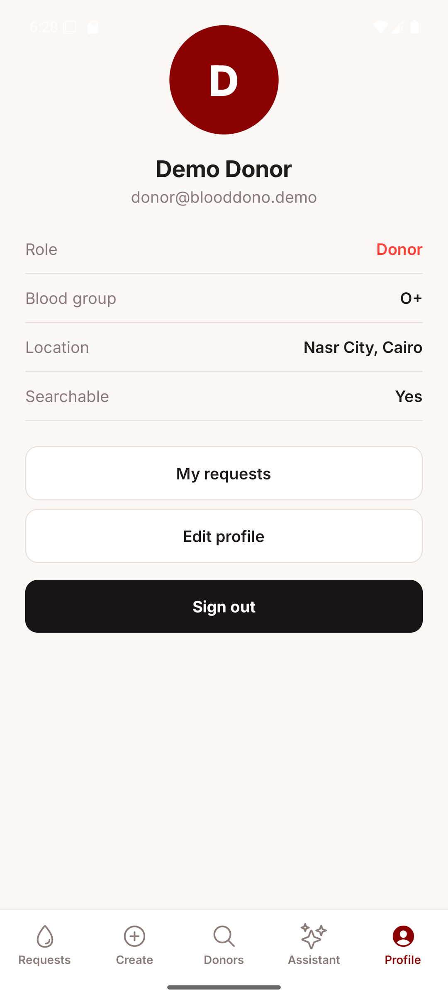
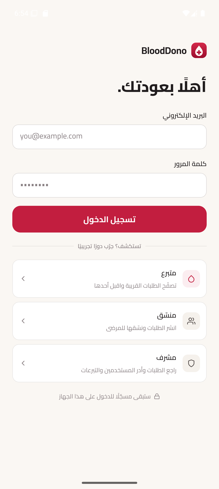

# BloodDono Mobile

[](https://github.com/amrogad/blooddono-mobile/actions/workflows/ci.yml)

A React Native app for connecting blood donors with nearby donation requests. Donors browse requests sorted by proximity, post their own, and search for compatible donors by blood group and location. Each request shows a live hospital map with the distance from wherever the donor is standing.

There's also a [web version](https://github.com/amrogad/blooddono) ([live demo](https://blooddono-two.vercel.app/)) on the same Supabase backend and the same edge functions, so the data lines up across both and the AI assistant behaves identically on either.

## Highlights

- 🔔 Push notifications for new compatible requests in your governorate
- 📍 Location-aware sorting, so nearby requests rise to the top automatically
- 🩸 Blood compatibility matching, not exact-type matching (O- donors see A+, B+, AB+ requests)
- 🗺️ Interactive hospital maps with live distance, built on Leaflet + OpenStreetMap (no API key needed)
- 🤖 AI eligibility assistant that can query the donor database through tool calling, not just answer from a prompt
- 🌐 Full Arabic + English support with RTL layout that mirrors automatically on switch
- 🌙 Dark and light mode, persisted across sessions

## Download

[**Download APK (v1.0.0)**](https://github.com/amrogad/blooddono-mobile/releases/download/v1.0.0/app-release.apk). Sideload on any Android device (enable "Install unknown apps" in settings).

## Demo accounts

The login screen has one-tap demo logins, no signup needed:

| Role | Email | Password |
|---|---|---|
| Donor | `donor@blooddono.demo` | `Demo123!` |
| Volunteer | `volunteer@blooddono.demo` | `Demo123!` |
| Admin | `admin@blooddono.demo` | `Demo123!` |

## Demo walkthrough

Under 3 minutes to see the core loop:

1. Log in with the Donor demo account.
2. Browse the requests feed. Your O+ matches are filtered by default and sorted nearest first.
3. Open a request to see the hospital on the map and the kilometer distance from you.
4. Switch to the Create tab and post a new request (3-step wizard).
5. Go to Find Donors, pick a blood group and governorate, and see compatible donors.
6. Open the Assistant tab and ask "I had surgery last month, can I donate?" It replies in whichever language the app is set to.
7. Switch to the Volunteer or Admin demo account to see the coordinator and admin views.

## Features

- Browse pending requests sorted by proximity to the donor's governorate and city, with "near you" badges and urgency sections (Critical, Urgent, Planned)
- Blood compatibility matching, so searching for A+ donors also surfaces O+ and O- donors who can safely donate
- Post a request in 3 steps: patient details, hospital location, blood group and date
- Interactive Leaflet map on each request showing the hospital pin, the donor's live position, and the straight-line distance between them
- Accept a request as a donor, which moves it from pending to in-progress
- Find compatible donors by patient blood group and location
- AI eligibility assistant for questions like "I take blood pressure medication, am I eligible?" It reads your blood group and city from your session rather than trusting the app to send them, and for availability questions like "how many donors near me could give me blood?" it calls a `find_compatible_donors` tool that runs a real query instead of guessing a number. Replies follow the active language
- Push notifications when a new request needs a compatible blood type in your governorate
- Arabic and English with automatic RTL layout mirroring, switchable without leaving the app
- Dark and light themes, persisted with AsyncStorage
- Real profile with blood group, role badge, and location
- Persistent sessions, so you stay signed in across restarts

## Screenshots

| EN · Light | AR · Dark |
|---|---|
|  |  |

| Request detail | Fullscreen map |
|---|---|
|  |  |

| AI assistant · EN | AI assistant · AR |
|---|---|
|  |  |

| Find donors | Profile |
|---|---|
|  |  |

| Login | |
|---|---|
|  |

## Architecture

```
Screens (expo-router)
        ↓
TanStack Query  ·  React Context (auth + theme + locale)
        ↓
Service layer (Supabase RPCs, Nominatim, Edge Functions)
        ↓
Supabase (PostgreSQL · Auth · Storage · Edge Functions)
        ↓
Groq (tool calling back into the donor table) · Expo push notifications
```

## Built with

- 13 screens across 3 route groups
- 6 shared components (BloodRoundel, RequestCard, Pills, Avatar, SkeletonCard, BrandHeader)
- 112 automated tests, plus a 15-case eval suite for the assistant
- Shared Supabase backend and edge functions with the web version

## Tech stack

### App
- React Native · Expo SDK 56 · TypeScript
- expo-router (file-based navigation, route groups for auth/tabs)
- TanStack Query (server state, caching, background refetch, skeleton loaders)
- React Context (auth session, theme, locale)
- Leaflet in a WebView with OpenStreetMap tiles (no maps API key required)
- expo-location for live position
- Nominatim (OpenStreetMap) for hospital geocoding
- react-i18next for Arabic/English with I18nManager RTL integration
- @expo-google-fonts/cairo + @expo-google-fonts/bricolage-grotesque

### Backend
- [Supabase](https://supabase.com/) for hosted auth, PostgreSQL, RPCs, and storage
- Supabase Edge Functions (Deno) for push notification fan-out and the eligibility assistant
- [Groq](https://groq.com/) (`openai/gpt-oss-20b`) for the assistant, called server-side on the free tier so the key never ships in the app
- Expo push notifications

## Testing

```bash
npm test -- --runInBand
```

112 tests across:

- Supabase service wrappers (donations, profiles, geocoding, assistant)
- Auth provider bootstrap
- Login screen
- The assistant's tool layer: argument resolution against the caller's profile, the compatibility table, and a check that donor identities never survive into what gets sent to the model
- Pure utilities: haversine distance, proximity sorting, blood compatibility, form validation, error mapping
- i18n key parity (every EN key has an AR translation)

Lint, types, and the full suite run on every push through GitHub Actions.

### Assistant evals

A green test suite says nothing about whether health information is correct, so the assistant is scored separately against 15 fixed questions with known-correct answers:

```bash
npm run eval
```

Each case checks whether the model called the donor lookup when it should have, whether the blood groups it lists match the compatibility rules the rest of the app enforces, and whether the answer carries the not-medical-advice line. It makes real API calls, so it runs on demand rather than in CI. It currently passes 15 of 15.

The first run scored 40%. One failure was real: the assistant claimed only A+ and O+ can donate to A+, leaving out A- and O-. Under-reporting compatible donors is the worst way for this app to be wrong. Blood compatibility now goes into the prompt from the same table the rest of the app uses, rather than being left to the model's own knowledge.

The rest of that 40% was the grader, not the model. It compared blood groups using an ASCII hyphen while the model wrote "O‑negative" with a non-breaking one, so four correct answers were scored as failures.

## Known limitations and what's next

Things I know are missing or rough, rather than things I'm hoping nobody notices:

- The assistant is question-and-answer only. It can look up donor counts, but it can't post a request, accept one, or change anything for you. Letting it act means a confirmation step and a much harder safety story, so it reads rather than writes.
- It never sees donor identities. The lookup returns counts grouped by blood group, so no names or photos leave the backend for the model provider. The trade is that it can't tell you who to contact, only how many people could help. Find Donors does that part.
- Answers are capped at 50 a day per account, tracked in Postgres. Groq's free tier also caps tokens per minute, so a burst of questions can briefly fail.
- Distribution is a sideloaded APK. There's no Play Store listing or internal testing track yet.
- New requests need a pull-to-refresh. Supabase Realtime is the obvious fix and isn't wired up yet.
- iOS is untested. The app is built with Expo and should run, but it has only been exercised on Android.
- Payments on the funding screen are recorded, not processed. There's no payment provider behind it.
- The eval set covers compatibility rules, tool routing, and safety-critical deferrals. It avoids questions whose correct answer varies by country, like exact tattoo or travel deferral periods, so the assistant's answers there are unverified.

## Why I built this

Blood shortages are a logistics problem: patients need specific types, donors are willing, but there's no fast way to connect the two. BloodDono is that connection. I wanted to build something real end to end instead of a toy demo, so it has live maps, push notifications, an AI feature, and a bilingual RTL interface.

## Getting started

Node LTS, a Supabase project, and either an Android emulator or the Expo Go app on a physical device.

```bash
npm install
cp .env.example .env
```

Fill in `.env`:

```
EXPO_PUBLIC_SUPABASE_URL=your-project-url
EXPO_PUBLIC_SUPABASE_ANON_KEY=your-anon-key
```

Start Metro:

```bash
npx expo start
```

Press `a` for Android or scan the QR code in Expo Go. No maps API key needed, since Leaflet uses OpenStreetMap tiles.

## Project structure

```
src/
├── app/
│   ├── (auth)/         login screen
│   ├── (tabs)/         requests, create, donors, assistant, profile
│   ├── request/[id]    request detail + inline map
│   ├── edit-request/   edit an existing request
│   ├── my-requests     requests posted by the current user
│   ├── profile-edit    edit name, blood group, location
│   ├── map             fullscreen hospital map
│   └── funds/          community fund + payment
├── components/         BloodRoundel, RequestCard, Pills, Avatar, SkeletonCard, BrandHeader
├── providers/          AuthProvider, ThemeProvider, LocaleProvider
├── services/           Supabase RPCs, geocoder, assistant Edge Function
├── hooks/              useProfile, useLocation, usePushNotifications
├── i18n/               en.json + ar.json, i18next singleton
├── utils/              distance, proximity sort, blood compatibility, validation, errors, mapHtml
├── constants/          theme tokens (colors, fonts, spacing, shadows)
└── data/               governorates + cities
```
