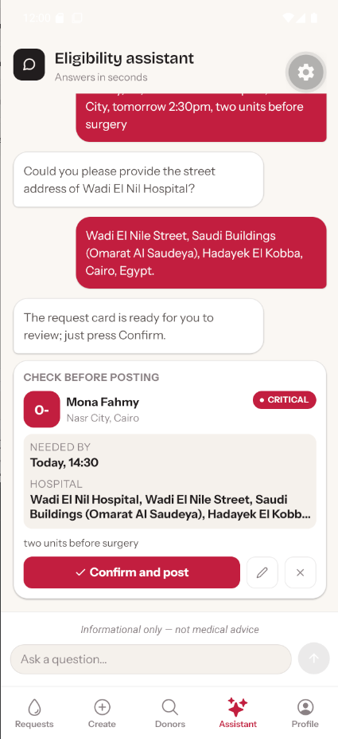

# BloodDono Mobile

A React Native app that connects blood donors with nearby patients who need them. Requests are sorted by how close the hospital is, shown on a live map with the distance from where you're standing, and pushed to you when a compatible one appears in your governorate. English and Arabic, with the layout mirroring to full RTL.

[Download APK](https://github.com/amrogad/blooddono-mobile/releases/download/v1.1.0/app-release.apk) · [Web version](https://github.com/amrogad/blooddono) · [Live demo](https://blooddono-two.vercel.app/)

[](https://github.com/amrogad/blooddono-mobile/actions/workflows/ci.yml)

## The assistant posts requests, it isn't just a chat box

Tell it in plain language that someone needs blood and it builds a complete donation request from the conversation, asking for anything it still needs, then hands you a card to check. It never writes to the database on its own: the request is inserted only when you press Confirm, under your own permissions.



It answers eligibility questions too, and for availability like "who can donate to A+?" it runs a real query against the donor table instead of guessing a number. Two database-backed tools drive it, both server-side in a Supabase Edge Function so the Groq key never ships in the app:

- `find_compatible_donors` looks up real availability by blood-type compatibility and city, and sends the model only aggregated counts, never donor names or photos
- `draft_donation_request` returns a validated draft; only your confirmation turns it into a row

The assistant has its own 24-case eval. An early 40% score exposed a real compatibility mistake, so I moved the compatibility rules out of the model's prompt and into the same source of truth the app uses.

## Built for the phone

- Requests sorted by real distance from your live position, falling back to governorate and city when location permission is denied
- Push notifications when a request needs a compatible type in your governorate
- Hospital and donors on an interactive Leaflet map inside a WebView, so there's no maps API key and no billing account
- One Supabase backend and edge functions shared with the web app, so a request posted on either shows up on the other

## Screenshots

| Requests feed | Request detail with map |
|---|---|
|  |  |

| Assistant | Arabic, dark, RTL |
|---|---|
|  |  |

## Try it

A one-tap demo login on the login screen, no signup:

| Role | Email | Password |
|---|---|---|
| User | `donor@blooddono.demo` | `Demo123!` |

## Known limitations

- New requests show up on pull-to-refresh, not live. The feed is served through a name-masking function rather than a direct table read, and Supabase Realtime follows the same row-level security, so live updates would need a broadcast layer rather than a plain subscription.
- Distribution is a sideloaded APK. There is no Play Store listing yet.
- iOS is untested. It is an Expo app and should run, but it has only been exercised on Android.

## Stack

App: React Native, Expo SDK 56, TypeScript, expo-router, TanStack Query, React Context, react-i18next with `I18nManager`.

Maps and location: Leaflet in a WebView with OpenStreetMap tiles, expo-location, Nominatim for geocoding.

Backend, as a managed service: Supabase for hosted auth, PostgreSQL, RPCs, storage and Edge Functions (Deno) for push fan-out and the assistant, Groq (`openai/gpt-oss-20b`) called server-side, and Expo push notifications.

Testing: 169 Jest and React Native Testing Library tests, plus a 24-case assistant eval. Lint, TypeScript and the full suite run on every push through GitHub Actions, with no repository secrets needed.

## Run it

Node LTS, a Supabase project, and either an Android emulator or Expo Go on a device.

```bash
npm install
cp .env.example .env   # add EXPO_PUBLIC_SUPABASE_URL and EXPO_PUBLIC_SUPABASE_ANON_KEY
npx expo start         # press a for Android, or scan the QR in Expo Go
```

```bash
npm test -- --runInBand   # 169 tests
npm run eval              # 24 assistant eval cases, makes real API calls
```
