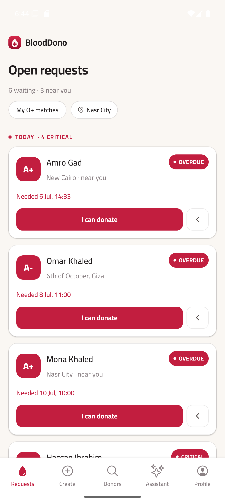
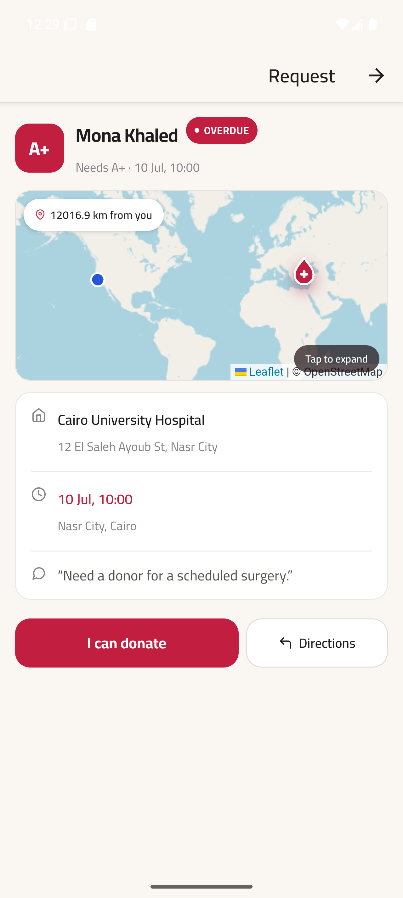
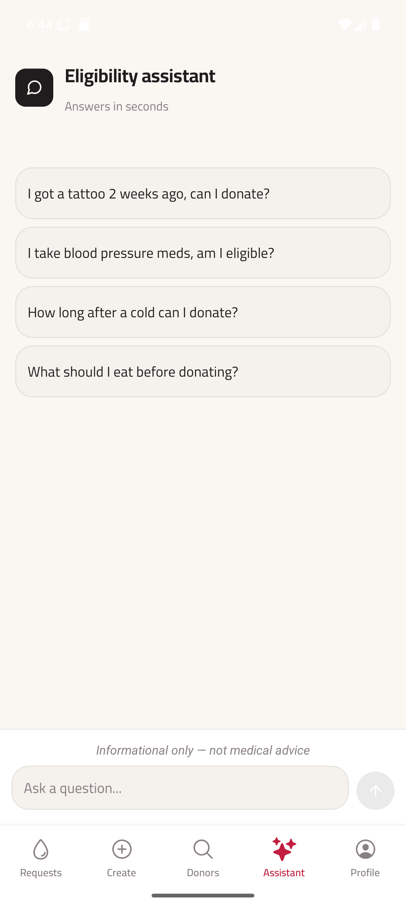
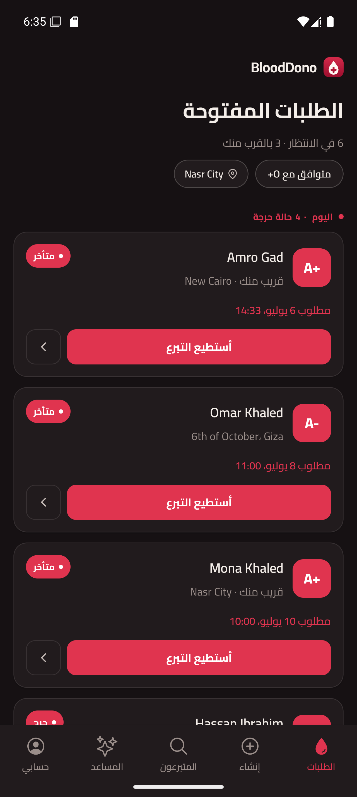

# BloodDono Mobile

A React Native app that connects blood donors with nearby patients who need them. Donors browse requests sorted by how close the hospital is, see each one on a live map with the distance from wherever they're standing, and get a push notification when a compatible request appears in their governorate. English and Arabic, with the layout mirroring to full RTL.

[Download APK](https://github.com/amrogad/blooddono-mobile/releases/download/v1.0.0/app-release.apk) · [Web version](https://github.com/amrogad/blooddono) · [Live demo](https://blooddono-two.vercel.app/)

## Why I built this

When someone needs blood, families end up posting in group chats and hoping the right person sees it in time. On a phone the problem becomes one of proximity: you want the requests you could actually reach today, not a list sorted by date. So the mobile version is built around location and notifications, where the web version is built around search.

## Highlights

- Location-aware sorting, so the requests you could reach soonest rise to the top
- Push notifications when a request needs a compatible type in your governorate
- Interactive hospital maps with live distance, on Leaflet and OpenStreetMap, no maps API key needed
- An AI eligibility assistant that queries the donor database through tool calling, and can draft a request for you to confirm
- Shares one Supabase backend and the same edge functions with the web app, so the data lines up across both

## Demo

One-tap demo logins on the login screen, no signup needed:

| Role | Email | Password |
|---|---|---|
| Donor | `donor@blooddono.demo` | `Demo123!` |
| Volunteer | `volunteer@blooddono.demo` | `Demo123!` |
| Admin | `admin@blooddono.demo` | `Demo123!` |

Under 3 minutes to see the core loop:

1. Log in with the Donor demo account.
2. Browse the requests feed. Your O+ matches are filtered by default and sorted nearest first.
3. Open a request to see the hospital on the map and the distance from you in kilometres.
4. Post a new request from the Create tab, in 3 steps.
5. Go to Find Donors, pick a blood group and governorate, and see compatible donors.
6. Open the Assistant tab and ask "I had surgery last month, can I donate?" It replies in whichever language the app is set to.
7. Switch to the Volunteer or Admin demo account for the coordinator and admin views.

## Screenshots

| Requests feed | Request detail with map |
|---|---|
|  |  |

| AI assistant | Arabic · dark · RTL |
|---|---|
|  |  |

## Architecture

```
Screens (expo-router)
        ↓
TanStack Query  ·  React Context (auth + theme + locale)
        ↓
Service layer (Supabase RPCs, Nominatim, Edge Functions)
        ↓
Supabase (PostgreSQL · Auth · Storage · Edge Functions)
        ↓
Groq (tool calling back into the donor table) · Expo push notifications
```

## Engineering

[](https://github.com/amrogad/blooddono-mobile/actions/workflows/ci.yml)

- Requests sorted by haversine distance from the donor's live position, falling back to governorate and city when location permission is denied
- Two database-backed AI tool calls: for availability questions the model runs a real query against the donor table rather than guessing a number, and for posting it returns a validated draft that only a human confirmation turns into a row
- Hospital and donor rendered on a Leaflet map inside a WebView, so there's no maps API key and no billing account
- 151 automated tests covering service wrappers, auth bootstrap, the assistant's tool layer, the draft confirmation card, pure utilities like haversine distance and blood compatibility, and a parity check that every English string has an Arabic translation
- Lint, TypeScript and the full Jest suite on every push through GitHub Actions, with no repository secrets needed, so a fork's CI goes green without any setup
- Arabic and RTL from one component tree, wired into React Native's `I18nManager` so mirroring is a direction change rather than a second set of styles

### How the assistant answers

A Supabase Edge Function runs a two-pass function-calling loop against Groq. Blood group and city come from the session rather than the request body, so a caller can't claim a profile that isn't theirs. The `find_compatible_donors` tool aggregates to counts before returning, so no donor names or photos reach the model provider. One test exists specifically to check that donor identities never survive into what gets sent to the model.

### How the assistant posts a request

It can also fill in a request for you, but it can't submit one. A second tool, `draft_donation_request`, gathers the patient details and returns a draft the app shows as a card. Nothing is written until you press Confirm, and the insert then runs from the app with your own session, under the same row-level policy as the form. The edge function is never given write access.

The tool is called `draft_` rather than `create_` on purpose: the name is part of the prompt, and a model that thinks it created something tends to say so. The function validates every field before the card sees it, so the blood group is one of the eight and the date is a real day that hasn't passed. The card is built from that validated object rather than from the model's arguments, so whatever the reply says afterwards, the fields you're confirming are clean. A patient's blood group is never filled in from your profile, since you are not the patient; if the model wasn't told it, the draft comes back as a question instead.

Whether a draft has been posted is held on the message rather than inside the card, because the card renders in a `FlatList` row. Local state there survives until the row is recycled, and a recycled card would come back offering to post the same request a second time.

### How the assistant is graded

A green test run says nothing about whether health information is correct, so the assistant is scored separately against 19 fixed questions with known-correct answers. Each case checks whether the model called the lookup when it should have, whether the blood groups it listed match the compatibility rules the app enforces, and whether the not-medical-advice line survived. The drafting cases add two of their own: that the reply never claims a request exists before you confirm it, and that a message missing the patient's blood group produces a question rather than a draft. It makes real API calls, so it runs on demand (`npm run eval`) rather than in CI.

The first run scored 40%, and one failure was real: the assistant claimed only A+ and O+ can donate to A+, leaving out A- and O-. Under-reporting compatible donors is the worst way for this app to be wrong. Compatibility now goes into the prompt from the same table the rest of the app uses instead of being left to the model's recall. The rest of that 40% was the grader, not the model: it compared blood groups with an ASCII hyphen while the model wrote "O‑negative" with a non-breaking one, scoring four correct answers as failures.

## Known limitations

- The assistant drafts a request but can't submit one, and it can't accept a request for you at all. Accepting commits you to showing up somewhere, which needs more than a confirmation card.
- The draft card is read-only. Fixing a typo means telling the assistant, or opening the draft in the full form.
- It never sees donor identities, so it can tell you how many people could help but not who. Find Donors does that part.
- Distribution is a sideloaded APK. There's no Play Store listing or internal testing track yet.
- iOS is untested. It's an Expo app and should run, but it has only been exercised on Android.
- New requests need a pull-to-refresh. Supabase Realtime is the obvious fix and isn't wired up.
- The eval set avoids questions whose correct answer varies by country, like exact tattoo or travel deferral periods, so answers there are unverified.

## Getting started

Node LTS, a Supabase project, and either an Android emulator or Expo Go on a device.

```bash
npm install
cp .env.example .env   # add EXPO_PUBLIC_SUPABASE_URL and EXPO_PUBLIC_SUPABASE_ANON_KEY
npx expo start         # press a for Android, or scan the QR in Expo Go
```

```bash
npm test -- --runInBand   # 118 tests
npm run eval              # 19 assistant eval cases, makes real API calls
```

## Tech stack

App: React Native, Expo SDK 56, TypeScript, expo-router, TanStack Query, React Context, react-i18next with `I18nManager`.

Maps and location: Leaflet in a WebView with OpenStreetMap tiles, expo-location, Nominatim for geocoding.

Backend, as a managed service: Supabase for hosted auth, PostgreSQL, RPCs and storage, Supabase Edge Functions (Deno) for push fan-out and the assistant, Groq (`openai/gpt-oss-20b`) called server-side so the key never ships in the app, and Expo push notifications.

Testing: Jest, React Native Testing Library.
